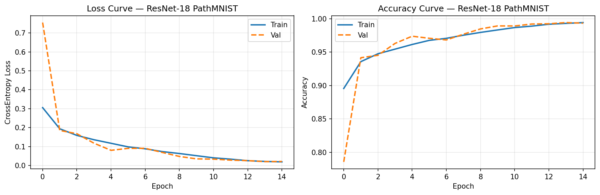
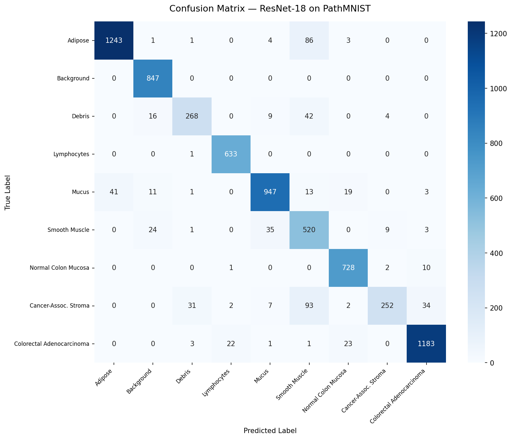
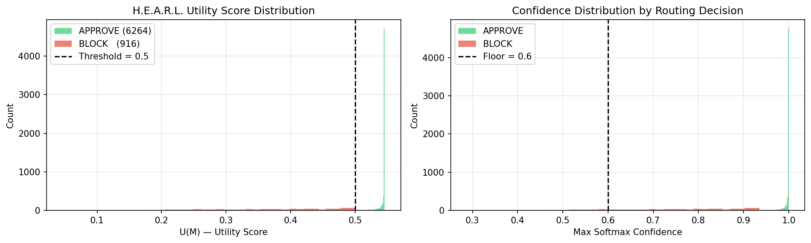
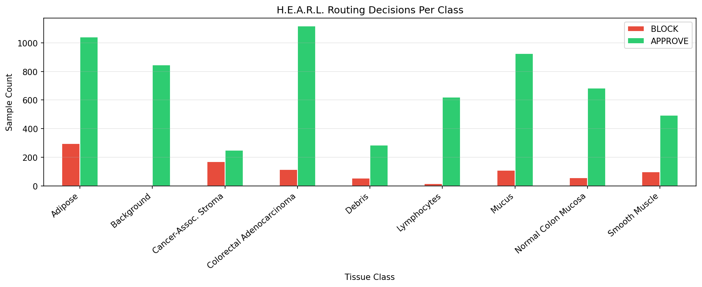
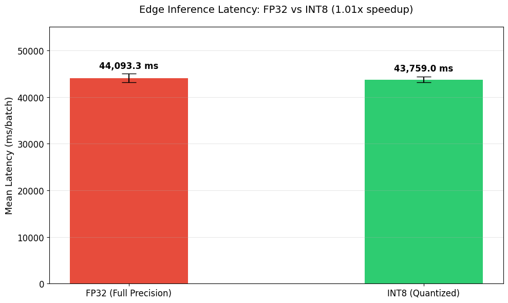

# Unified Clinical Edge AI

### Deterministic Safety Architecture for Clinical AI on Edge Devices

**Unified Clinical Edge AI** is a research project exploring how probabilistic deep learning models can be placed behind a deterministic execution-policy layer before their outputs are passed to downstream generative systems.

The system uses **PathMNIST histopathology data**, a **ResNet-18 tissue classifier**, and the **H.E.A.R.L. (Hyper-Efficient Agentic Routing Layer)** framework to establish a policy-controlled boundary between model inference and downstream clinical report generation.

The central principle is simple:

> **A probabilistic prediction should not automatically become a downstream action.**

Instead, the classifier produces a prediction and confidence score, after which H.E.A.R.L. evaluates the result against explicit routing constraints. High-confidence outputs can proceed toward a generative reporting pipeline, while insufficient-confidence outputs are blocked and escalated for human review.

**Author:** Muhammad Nameer Shah
**Affiliation:** University of Agriculture Peshawar — BS Artificial Intelligence
**Contact:** [smns3960@gmail.com](mailto:smns3960@gmail.com)

---

## Overview

Clinical AI systems combine several probabilistic components:

* Deep learning classifiers
* Confidence estimation
* Large language models
* Retrieval-augmented generation
* Multimodal reasoning

While these components can produce useful predictions and reports, a downstream system should not blindly trust every probabilistic output.

Unified Clinical Edge AI investigates a different architecture:

```text
                  ┌─────────────────────────┐
                  │   PathMNIST Tissue Patch │
                  └────────────┬────────────┘
                               │
                               ▼
                  ┌─────────────────────────┐
                  │   ResNet-18 Classifier  │
                  │   Tissue Classification │
                  └────────────┬────────────┘
                               │
                               ▼
                  ┌─────────────────────────┐
                  │ Probability Distribution│
                  │      P(y | x)            │
                  └────────────┬────────────┘
                               │
                               ▼
              ┌──────────────────────────────────┐
              │       H.E.A.R.L. Policy Layer    │
              │                                  │
              │  Confidence + Cost + Latency     │
              │          Evaluation              │
              └───────────────┬──────────────────┘
                              │
                 ┌────────────┴────────────┐
                 │                         │
                 ▼                         ▼
        ┌─────────────────┐       ┌─────────────────────┐
        │  Policy Pass    │       │    Policy Block     │
        │                 │       │                     │
        │ Continue to     │       │ Stop downstream     │
        │ report pipeline │       │ generation          │
        └────────┬────────┘       │                     │
                 │                │ Human review        │
                 │                │ / escalation        │
                 │                └─────────────────────┘
                 ▼
        ┌─────────────────────┐
        │ Gemini RAG / VLM    │
        │ Report Generation   │
        └──────────┬──────────┘
                   │
                   ▼
        ┌─────────────────────┐
        │ Structured Clinical │
        │      Report         │
        └─────────────────────┘
```

The architecture intentionally separates:

**Inference → Policy → Generation**

rather than allowing:

**Inference → Generation**

without an explicit safety boundary.

---

## The Problem

Deep learning classifiers produce probability distributions rather than deterministic guarantees.

Likewise, generative AI systems can transform model outputs into natural-language reports, but they introduce another probabilistic component into the pipeline.

The architectural problem is therefore not simply whether a classifier is accurate.

The question is:

> **What prevents an uncertain prediction from being propagated into a downstream generative system?**

In a safety-sensitive setting, an unchecked low-confidence prediction can become an operational failure if it is automatically passed to subsequent systems.

Unified Clinical Edge AI addresses this problem by introducing a deterministic policy gate between the classifier and the downstream reporting layer.

---

# H.E.A.R.L.

## Hyper-Efficient Agentic Routing Layer

H.E.A.R.L. is the deterministic routing layer responsible for evaluating whether a model output should be allowed to proceed.

The framework considers three primary signals:

* **Classification confidence**
* **Computational cost**
* **Inference latency**

These signals are represented by the utility function:

$$
U(M) = w_1 A(M) - w_2 C(M) - w_3 L(M)
$$

Where:

| Symbol | Meaning                                     |
| ------ | ------------------------------------------- |
| $A(M)$ | Classification confidence / accuracy signal |
| $C(M)$ | Computational or inference cost             |
| $L(M)$ | Inference latency                           |
| $w_1$  | Accuracy priority weight                    |
| $w_2$  | Cost penalty weight                         |
| $w_3$  | Latency penalty weight                      |

The utility function provides an auditable policy score that can be used alongside hard safety constraints.

---

## Safety Gate

The routing boundary can enforce a minimum confidence requirement:

$$
\max_c P(y=c \mid x) \geq \tau
$$

where $\tau$ represents the configured safety threshold.

For the current H.E.A.R.L. design, the default threshold is:

$$
\tau = 0.85
$$

Conceptually:

```text
                    Model Prediction
                           │
                           ▼
                  Calculate P(y | x)
                           │
                           ▼
                  ┌────────────────┐
                  │ Confidence >=  │
                  │     0.85 ?     │
                  └───────┬────────┘
                          │
               ┌──────────┴──────────┐
               │                     │
              YES                    NO
               │                     │
               ▼                     ▼
        Policy-approved        BLOCK / ESCALATE
               │                     │
               ▼                     ▼
        Report generation       Human review
```

A blocked prediction does not automatically proceed to the downstream report-generation stage.

---

# Project Development

The project is organized as a multi-phase research pipeline.

## Phase 1 — Baseline Classification

The first phase establishes a ResNet-18 baseline for PathMNIST tissue classification.

### Dataset

PathMNIST:

* Training samples: **89,996**
* Validation samples: **10,004**
* Test samples: **7,180**
* Number of classes: **9**

### Model

* Architecture: **ResNet-18**
* Initialization: **ImageNet pretrained**
* Training strategy: **Full fine-tuning**
* Epochs: **15**
* Optimizer: **Adam**
* Learning-rate schedule: **Cosine Annealing**

### Results

| Metric        |     Result |
| ------------- | ---------: |
| Test Accuracy | **92.21%** |
| Macro AUC     | **0.9861** |

The baseline establishes the classification performance used as the foundation for subsequent edge and routing experiments.

---

## Phase 2 — Edge Optimization + H.E.A.R.L.

Phase 2 extends the baseline toward resource-constrained inference.

The primary objectives are:

1. Reduce inference resource requirements.
2. Investigate model quantization for edge execution.
3. Introduce deterministic H.E.A.R.L. routing.
4. Measure confidence-based routing behavior.
5. Record routing decisions and performance characteristics.

The repository includes Phase 2 outputs including:

* `phase2_metrics.json`
* `hearl_routing_analysis.png`
* `hearl_per_class_decisions.png`
* `latency_comparison.png`
* `routing_log.csv`

These artifacts provide evidence for analyzing routing behavior and edge-performance characteristics.

---

## Phase 3 — RAG Integration

Phase 3 investigates the downstream generative component.

The intended pipeline is:

```text
PathMNIST Image
      │
      ▼
ResNet-18 Prediction
      │
      ▼
H.E.A.R.L. Policy Gate
      │
      ├── BLOCK ──────────────► Human Review
      │
      └── APPROVE
             │
             ▼
       Gemini RAG Pipeline
             │
             ▼
    Structured Clinical Report
```

The important architectural constraint is that the generative layer is **downstream of the policy layer**.

The repository contains Phase 3 artifacts including:

* `phase3_pipeline_summary.json`
* `clinical_reports.json`

---

# Phase 1 → Phase 3 Pipeline

The complete research direction can therefore be summarized as:

```text
┌────────────────────────────────────────────────────────────┐
│                         PHASE 1                             │
│                                                            │
│  PathMNIST → ResNet-18 → Classification Baseline          │
│                                                            │
│  Accuracy: 92.21%                                         │
│  Macro AUC: 0.9861                                        │
└──────────────────────────┬─────────────────────────────────┘
                           │
                           ▼
┌────────────────────────────────────────────────────────────┐
│                         PHASE 2                             │
│                                                            │
│  ResNet-18 → Edge Optimization → H.E.A.R.L. Router        │
│                                                            │
│  Quantization + Confidence + Cost + Latency                │
│                    ↓                                       │
│            Deterministic Policy Gate                       │
└──────────────────────────┬─────────────────────────────────┘
                           │
                           ▼
┌────────────────────────────────────────────────────────────┐
│                         PHASE 3                             │
│                                                            │
│  Policy-approved prediction → Gemini RAG Pipeline          │
│                             ↓                              │
│                   Structured Report                         │
│                                                            │
│  Policy-blocked prediction → Human Review                  │
└────────────────────────────────────────────────────────────┘
```

---

# Repository Structure

The repository currently contains the main experimental notebooks and generated evaluation artifacts:

```text
unified-clinical-edge-ai/
│
├── unified_clinical_edge_ai_phase1_baseline.ipynb
│   └── Phase 1: ResNet-18 PathMNIST baseline
│
├── unified_clinical_edge_ai_phase2_hearl.ipynb
│   └── Phase 2: Quantization + H.E.A.R.L. routing
│
├── unified_clinical_edge_ai_phase3_rag.ipynb
│   └── Phase 3: Gemini RAG integration
│
├── clinical_reports.json
│   └── Generated clinical-report outputs
│
├── phase2_metrics.json
│   └── Phase 2 evaluation metrics
│
├── phase3_pipeline_summary.json
│   └── Phase 3 pipeline summary
│
├── routing_log.csv
│   └── H.E.A.R.L. routing decisions
│
├── training_curves.png
│   └── Training loss / accuracy visualization
│
├── confusion_matrix.png
│   └── Per-class classification confusion matrix
│
├── hearl_routing_analysis.png
│   └── H.E.A.R.L. routing analysis
│
├── hearl_per_class_decisions.png
│   └── Per-class routing decisions
│
├── latency_comparison.png
│   └── Inference latency comparison
│
├── LICENSE
└── README.md
```

---

# Experimental Artifacts

## Training Curves



## Confusion Matrix



## H.E.A.R.L. Routing Analysis



## Per-Class H.E.A.R.L. Decisions



## Latency Comparison



---

# Quickstart

## 1. Clone the Repository

Clone the repository and enter its directory:

```bash
git clone <repository-url>
cd unified-clinical-edge-ai
```

## 2. Install Dependencies

The baseline notebook uses the following core Python packages:

```bash
pip install torch torchvision medmnist scikit-learn matplotlib seaborn
```

## 3. Run the Baseline

Open:

```text
unified_clinical_edge_ai_phase1_baseline.ipynb
```

The notebook can be executed using Google Colab with a GPU runtime such as a T4.

---

# Research Roadmap

| Phase                                  | Status       | Description                                                                       |
| -------------------------------------- | ------------ | --------------------------------------------------------------------------------- |
| **1 — Baseline Training**              | Completed    | ResNet-18 PathMNIST classifier with 92.21% test accuracy and 0.9861 Macro AUC     |
| **2 — Edge Optimization + H.E.A.R.L.** | Experimental | Quantization, deterministic routing, latency analysis, and routing logs           |
| **3 — RAG Integration**                | Experimental | Gemini-based downstream report-generation pipeline gated by H.E.A.R.L.            |
| **4 — Technical Paper**                | Planned      | Consolidation of methodology, experiments, and findings into an academic preprint |

---

# Design Principles

### 1. Separate Inference from Execution

A model prediction should not automatically determine what happens next.

```text
Inference ≠ Execution Policy
```

### 2. Gate Before Generation

The generative reporting layer should sit behind an explicit routing boundary.

```text
Classifier
    ↓
Policy Gate
    ↓
Generative System
```

### 3. Prefer Explicit Failure States

When a prediction does not satisfy the configured policy, the system should have an explicit blocked/escalated path rather than silently proceeding.

### 4. Keep Routing Auditable

Routing decisions should expose relevant signals such as:

* Predicted class
* Confidence
* Latency
* Utility score
* Routing decision
* Escalation state

### 5. Optimize for Edge Constraints

Clinical AI systems may need to operate under constrained compute and latency budgets.

The project therefore investigates quantization and policy-aware routing as mechanisms for reducing unnecessary downstream computation.

---

# Limitations

This repository represents a research prototype rather than a clinically validated diagnostic system.

The experiments are based on the **PathMNIST** dataset and are intended to investigate architectural concepts around edge inference, deterministic routing, and downstream generative systems.

The reported classification performance should not be interpreted as evidence of clinical efficacy.

In particular:

* The system is not a medical device.
* The model is not validated for clinical diagnosis.
* PathMNIST performance does not establish real-world clinical performance.
* Confidence thresholds require task-specific validation before deployment.
* Generative reports require appropriate human oversight.
* The H.E.A.R.L. framework is an experimental policy architecture, not a substitute for clinical governance or regulatory validation.

---

# Research Direction

The broader research question behind Unified Clinical Edge AI is:

> **Can deterministic policy layers provide a reliable execution boundary around probabilistic AI systems operating under resource and safety constraints?**

The project explores this question across three interacting layers:

```text
┌──────────────────────┐
│ Probabilistic Model  │
│                      │
│ ResNet-18            │
│ PathMNIST            │
└──────────┬───────────┘
           │
           ▼
┌──────────────────────┐
│ Deterministic Policy │
│                      │
│ H.E.A.R.L.           │
│ Confidence           │
│ Cost                 │
│ Latency              │
└──────────┬───────────┘
           │
           ▼
┌──────────────────────┐
│ Generative Layer     │
│                      │
│ Gemini RAG / VLM     │
│ Structured Reports   │
└──────────────────────┘
```

This separation is the core architectural thesis of the project.

---

# Citation

If you use this work, please cite:

```text
Shah, M. N. (2026).
Unified Clinical Edge AI: Decoupling Probabilistic Inference
from Deterministic Execution in Clinical Tissue Classification.
GitHub.
```

---

# License

This project is licensed under the **Muhammad Nameer Shah Open Research License**.

See [`LICENSE`](LICENSE) for the full terms.
